# Getting Started - Setting up your AI Development Environment

As a particpant of the hands-on, you should already be setup with access to the SAP Business Application Studio landscape below which you can use as your development environment.

## Accessing SAP Business Application Studio (SBAS)

Navigate to https://lcapteched.eu10.build.cloud.sap/lobby

<span style="color:red">**NOTE: BAS AI is only supported on Chrome. Please ensure you use the Chrome Browser.** </span>

## Accessing the Dev Space Manager

On the SAP Build landing page, click button **Switch Product** in the top right corner and select **Dev Space Manager**.<br>
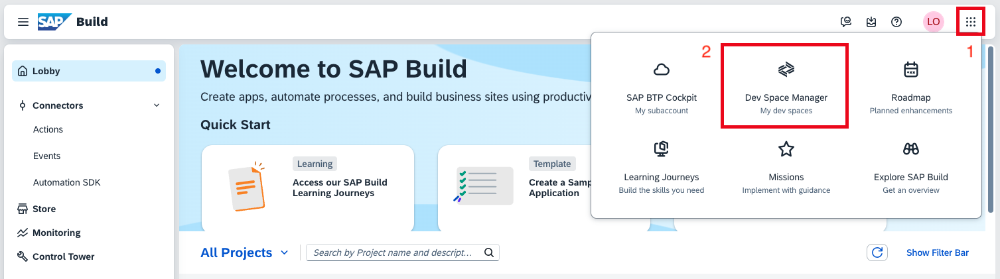

## Creating the Development Space


Enter a name for your development space and select application profile Full Stack Cloud Application.

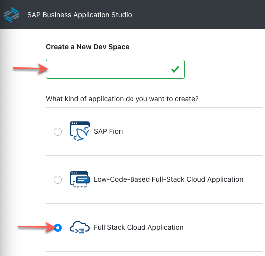

In the lower right corner of the page press button Create Dev Space. <br>


## Opening the Development Space

Make sure your development space has status running. If stopped, click the start button. <br>

Once running, click on the development space name to open it. This can take some time.<br>

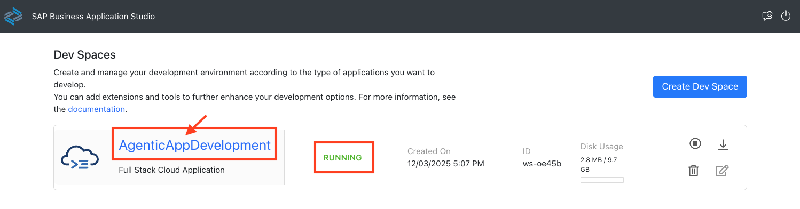

Click **OK** in the popup window to accept the tracking settings in the newly created dev space.


## Open your project folder

Open the explorer icon from the left hand side:

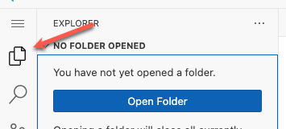

And select **Open Folder** button

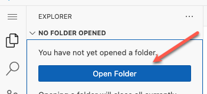

Select the **Projects** folder from the drop down


Click **OK** and your window will reload


## Configure Cline (AI Client)

1. Go to “Extensions” tab, confirm the text on the screen.

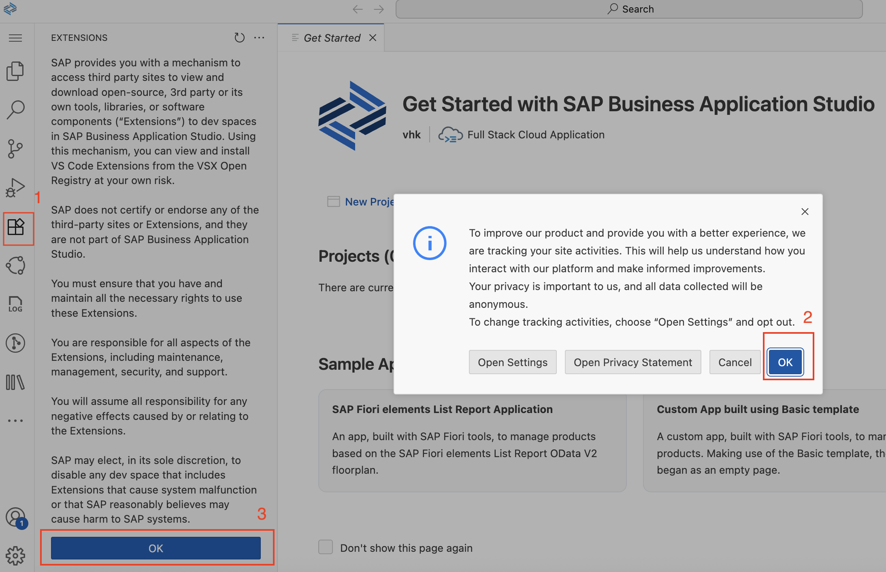

2. Download [claude-dev VSIX](./claude-dev-3.36.0%201.vsix).
3. Drag and drop the claude-dev VSIX to the Extensions pane. Wait until cline extension is installed.

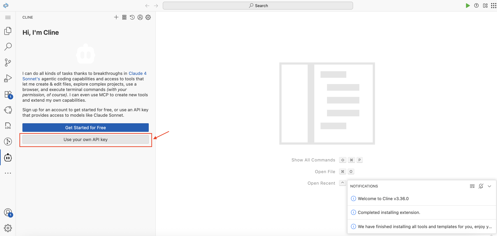

3. Open Cline, choose `Use your own API Key`, select API Provider `SAP AI Core`, selectmodel `anthropic--claude-sonnet-4`.

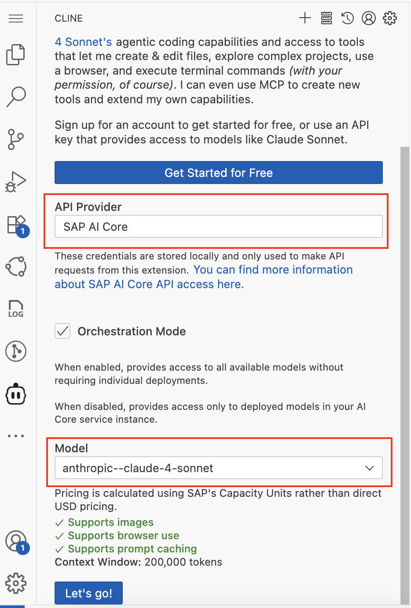

4. Click on `Lets Go` button.
5. Close all cline notifications.

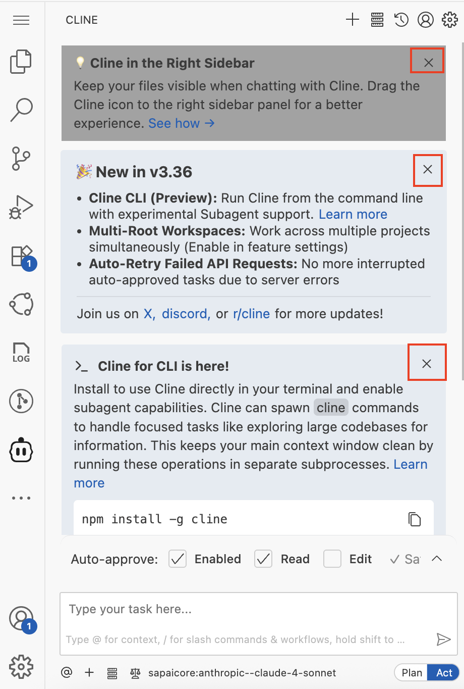

6. **Collapse Mcp responses**
   - In the **Cline Settings**, Click on the **Feature Settings** section.
   - Check the option `Collapse MCP Responses`

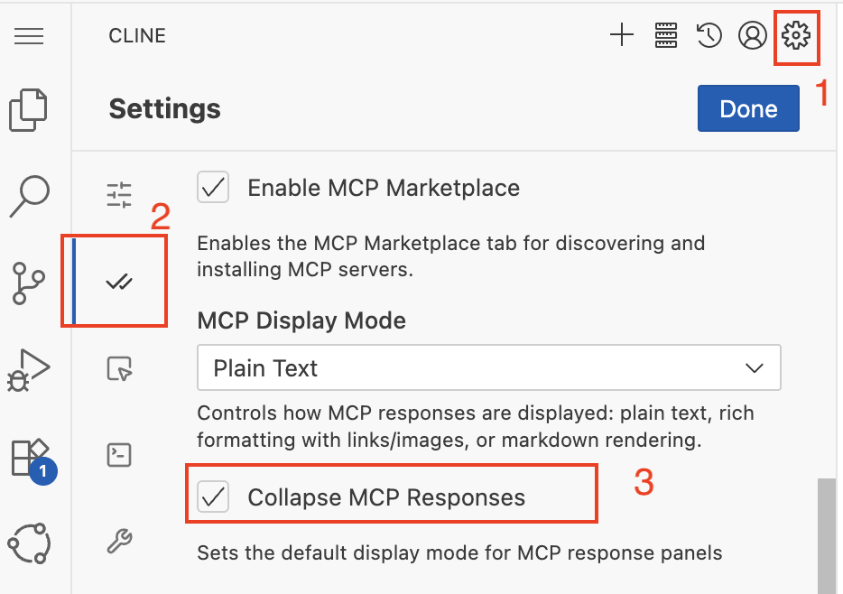

7. **Disable Browser Tool Usage**

   - In the **Cline Settings**, Click on the **Browser** section.
   - Check the option **Disable browser tool usage**.

     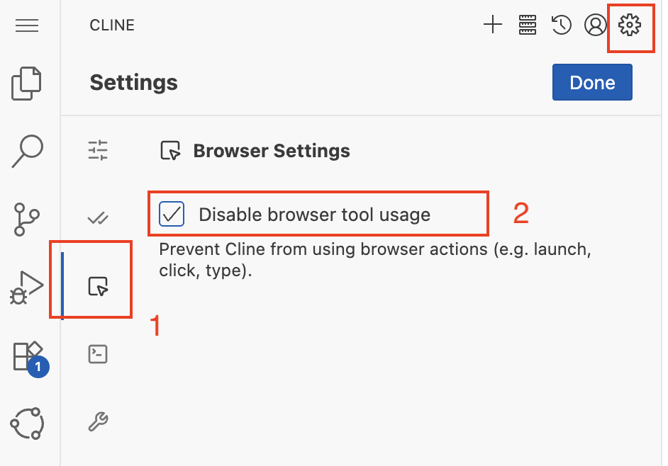

## Install and Configure MCP Servers

1. **Install MCP Servers and SAP Fiori Generator**

   - Go to the top menu and select **Terminal > New Terminal**.

   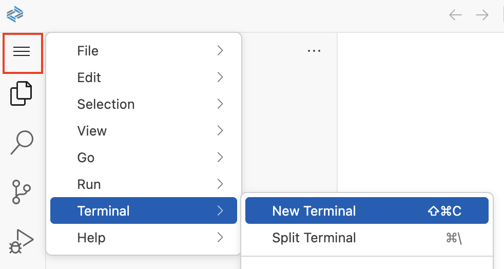

   - Install the **Fiori MCP Server**:

   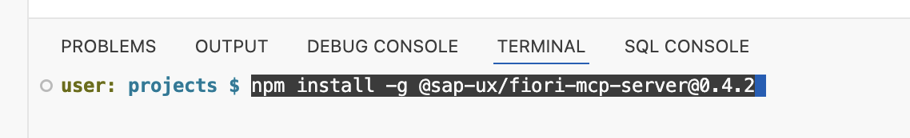

   Execute

   ```bash
   npm install -g @sap-ux/fiori-mcp-server@0.4.1
   ```

   - Install the **CAP MCP Server**:

   Execute

   ```bash
   npm install -g @cap-js/mcp-server@latest
   ```

   - Install the **SAP Fiori application generator**:

   Execute

   ```bash
   npm install -g @sap/generator-fiori@latest
   ```

2. Reload SBAS

3. **Configure MCP Server**

   - In the Cline panel, Click the **MCP Servers** icon in the top-right corner.
   - Click on Configure.
   - Select **Configure MCP Servers**.  
     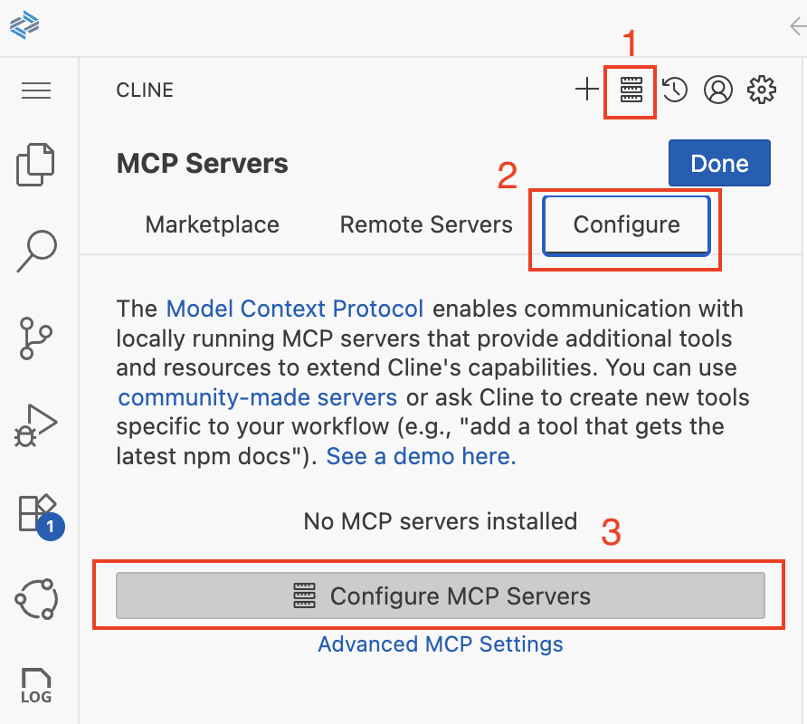

4. **Update `cline_mcp_settings.json`**

   - Configure MCP servers by editing your Cline MCP settings file (`cline_mcp_settings.json`):
   - Copy below content and Save file.
     ```json
     {
       "mcpServers": {
         "fiori-mcp": {
           "type": "stdio",
           "timeout": 600,
           "command": "npx",
           "args": ["-y", "@sap-ux/fiori-mcp-server@0.4.1"]
         },
         "cds-mcp": {
           "type": "stdio",
           "command": "npx",
           "args": ["-y", "@cap-js/mcp-server"],
           "env": {}
         }
       }
     }
     ```
     - close file `cline_mcp_settings.json`.

5. Verify MCP servers are installed and enabled. Click on Done.

   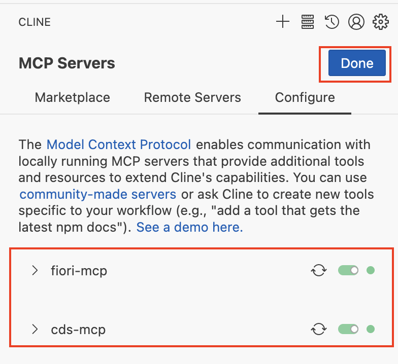

## Configure Rules for MCP Servers

1. Click the `Manage cline rules and workflows` button.

   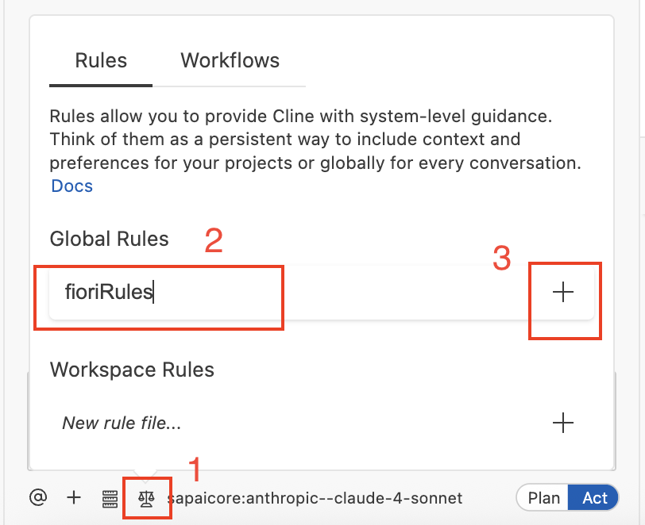

2. To add a global rule, enter a rule name `fioriRules` and click the + icon as shown in screenshot above.
3. File `fioriRules.md` is opened in the editor panel.
4. Copy and paste following rules.

```
## Rules for creation or modification of SAP Fiori elements apps

- When asked to create an SAP Fiori elements app check whether the user input can be interpreted as an application organized into one or more pages containing table data or forms, these can be translated into a SAP Fiori elements application, else ask the user for suitable input.
- The application typically starts with a List Report page showing the data of the base entity of the application in a table. Details of a specific table row are shown in the ObjectPage. This first Object Page is therefore based on the base entity of the application.
- An Object Page can contain one or more table sections based on to-many associations of its entity type. The details of a table section row can be shown in an another Object Page based on the associations target entity.
- The data model must be suitable for usage in a SAP Fiori elements frontend application. So there must be one main entity and one or more navigation properties to related entities.
- Each property of an entity must have a proper datatype.
- For all entities in the data model provide primary keys of type UUID (technical key) and ID (business key) fields.
- When creating sample data in CSV files, all primary keys and foreign keys MUST be in UUID format (e.g., `550e8400-e29b-41d4-a716-446655440001`).
- When generating or modifying the SAP Fiori elements application on top of the CAP service use the Fiori MCP server if available.
- When attempting to modify the SAP Fiori elements application like adding columns you must not use the screen personalization but instead modify the code of the project, before this first check whether an MCP server provides a suitable function.
- When previewing the SAP Fiori elements application use the most specific `npm run watch-*` script for the app in the `package.json`. If `npm run watch-*` script is already opened/running in a terminal, do not start another terminal window.
- MUST NOT use `npm start`, `npm run start`, `cds serve`, `cds-serve`, `sleep`.
- Must not open http://localhost:4004/ after lauching preview
- After launching the application stop and wait for user commands
```

5. Save file `fioriRules.md`.
6. Add another global rule `cdsRules` and click the + icon.
7. File `cdsRules.md` is opened in editor panel.
8. Copy and paste following rules.

```
- You MUST search for CDS definitions, like entities, fields and services (which include HTTP endpoints) with cds-mcp, only if it fails you MAY read \*.cds files in the project.
- You MUST search for CAP docs with cds-mcp EVERY TIME you create, modify CDS models or when using APIs or the `cds` CLI from CAP. Do NOT propose, suggest or make any changes without first checking it.
- When creating new CAP project ask cds mcp server. while using cds init, do not include any --add options (e.g., --add hana, --add sqlite, --add tiny-sample, etc.). Only use the plain form: cds init
- You MUST NOT use EDM JSON syntax for CDS.
```

9. Save file `cdsRules.md`.

## Summary

With the setup procedure done, you now have completed:

- Access to SAP Business Application Studio
- Creation of your development space
- Configure AI client - Cline

Continue to - [Exercise 2 - Generate CAP Project and Fiori List Report App based on Image](../ex1.0/README.md)
