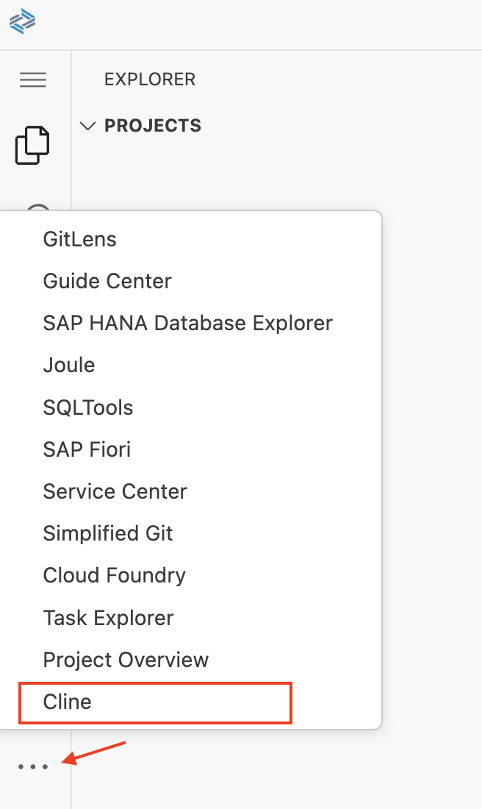
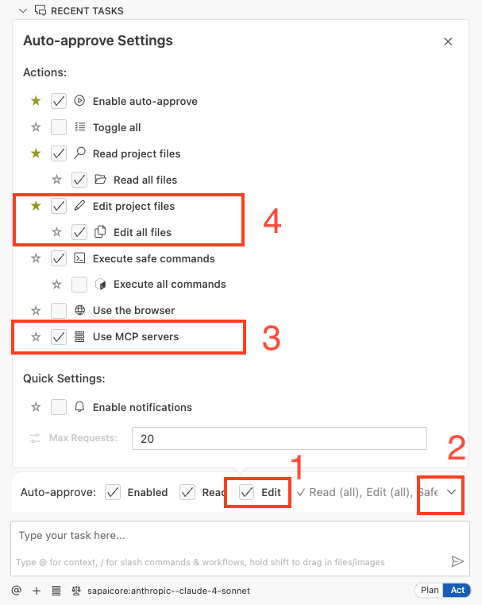

# Getting Started - Setting up your AI Development Environment

As a particpant of the hands-on, you should already be setup with access to the SAP Business Application Studio landscape below which you can use as your development environment.

## Accessing SAP Business Application Studio (SBAS)

Navigate to https://lcapteched.eu10.build.cloud.sap/lobby

**NOTE: BAS AI is only supported on Chrome. Please ensure you use the Chrome Browser.** 

## Accessing the Dev Space Manager

On the SAP Build landing page, click button **Switch Product** in the top right corner and select **Dev Space Manager**. 

## Opening the Development Space

Make sure your development space has status running. If stopped, click the start button.  

Once running, click on the development space name to open it. This can take some time. 

Click **OK** in the popup window to accept the tracking settings in the newly created dev space.

## Open your project folder

Open the explorer icon from the left hand side:

And select **Open Folder** button

Select the **Projects** folder from the drop down

Click **OK** and your window will reload

## Configure Cline (AI Client)

1. Open Cline

  

2. choose `Use your own API Key`.

  

3. select API Provider `SAP AI Core`, selectmodel `anthropic--claude-sonnet-4`.

  

4. Click on `Lets Go` button.
5. Close all cline notifications.

  

6. **Collapse Mcp responses**
   - In the **Cline Settings**, Click on the **Feature Settings** section.
   - Check the option `Collapse MCP Responses`

7. **Disable Browser Tool Usage**

   - In the **Cline Settings**, Click on the **Browser** section.
   - Check the option **Disable browser tool usage**.

  

## Enable Auto-Approve settings for Cline

  - Enable auto-approval for file modifications from Cline.  
  - Enable auto-approval for MCP server usage. 

  

## Summary

With the setup procedure done, you now have completed:

- Access to SAP Business Application Studio
- Configure Cline

Continue to - [Exercise 2 - Generate CAP Project and Fiori List Report App based on Image](../ex1.0/README.md)

## TroubleShoot:
No Dev space available in BAS - [Create new dev space and install cline extension manually](README2.md)

