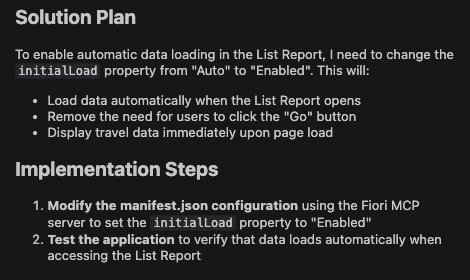

## Enable automatic data loading in List Report

1. Close the previous task.

2. Start new task. Select **Plan Mode**.

3. Copy and paste the following prompt into the task input:  
   ```
   Enable automatic data loading in List Report. Use fiori mcp
   ```
4. Press `Enter` to execute the task.
5. Cline prepares an **Implementation Plan**.
6. Once the implementation plan is ready, review it.

> [!Note]
> The implementation plan generated by Cline may differ from the example shown below.



7. Switch to **Act mode**.

8. Cline executes the implementation plan.

9. When the task is complete. Verify data is loaded on list report table without pressing GO button.


Continue to - [Exercise 1.2 - Add destination column to List Report table](../ex1.2/README.md)