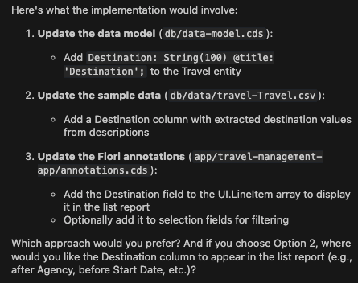
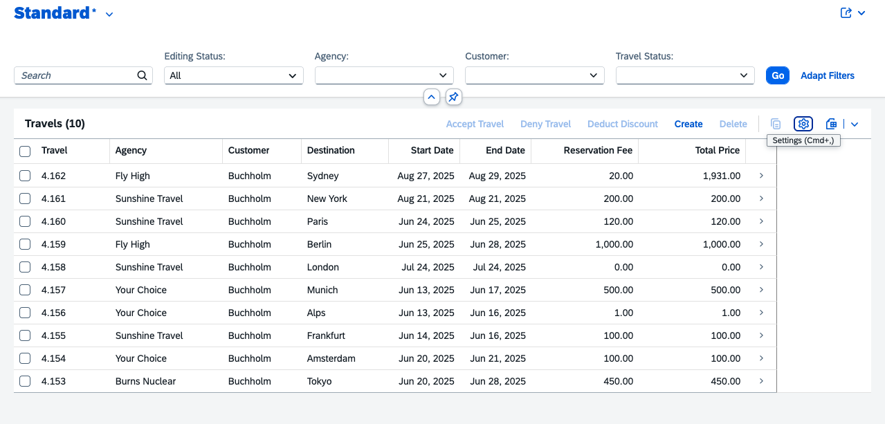

## Add destination column to List Report table

1. Close the previous task.

2. Start new task. Select **Plan Mode**.

3. Copy and paste the following prompt into the task input:  
   ```
   Create and add a new column "Destination" to the list report table
   ```
4. Press `Enter` to begin. Cline will generate an **Implementation Plan**.

**Note:**

- Cline may ask additional questions to prepare the plan. Enter the following information only if cline asks for it:
    1. I have no destination fields in travel entity. Would you like to add destination field to the CDS data model ? `Yes`
    2. Where the column should appear in list report? `next to agency column`
    3. Would you like to include sample data? `yes`

5. Review the plan when ready.

> [!NOTE]
> The implementation plan generated by Cline may differ from the example shown below.



6. Switch to **Act mode**.
7. Cline will execute the implementation plan.
8. After completion, confirm the destination column appears in the list report.




Continue to - [Exercise 1.3 - Add Analytical Chart to List Report Page](../ex1.3/README.md)