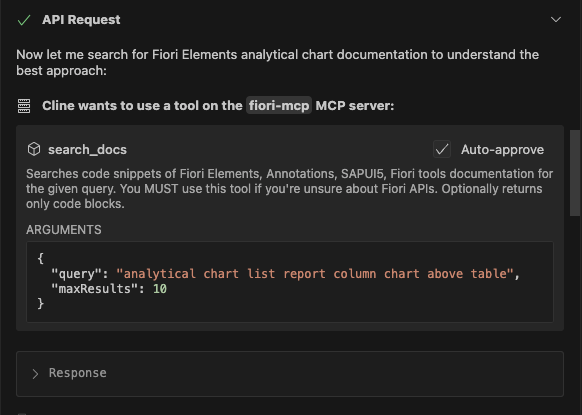
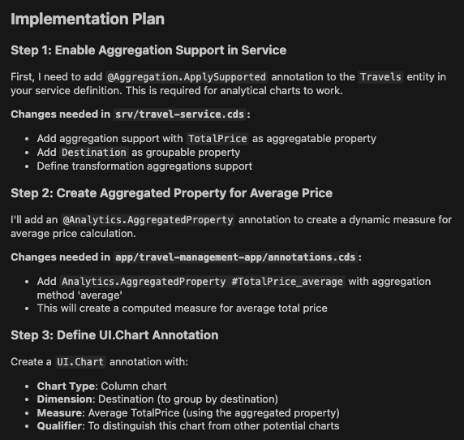
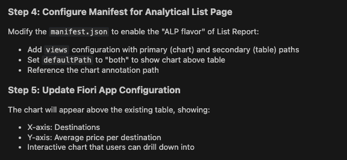
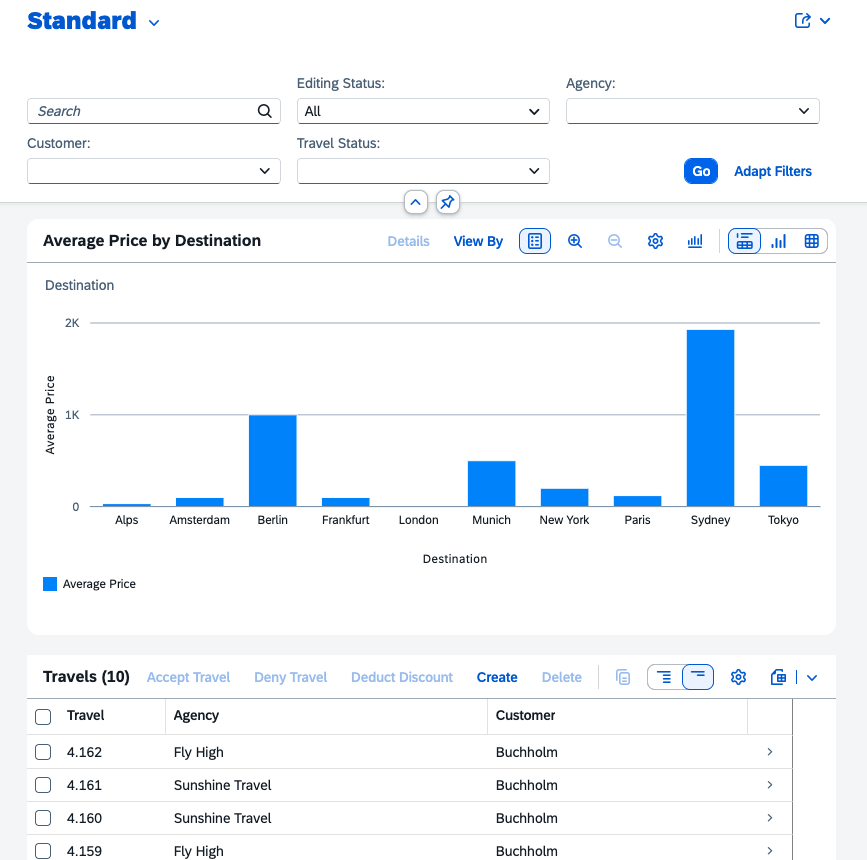

## Add an analytical column chart to the List Report 

1. Close the previous task.

2. Start new task. Select **Plan Mode**.

3. Enter prompt in the task input:  
   ```
   Add an analytical column chart to the List Report (ALP) that displays the average price per destination.
   Configure Price as an aggregated property in the analytical chart,
   and use the Views configuration to display the analytical chart above the table.
   Use fiori mcp
   ```
4. Press `Enter` to begin. Cline will generate an **Implementation Plan**.

5. Make sure Cline uses fiori-mcp to understand best approach for analytical chart creation.



6. Review the plan when ready. 

> [!NOTE]
> The implementation plan generated by Cline may differ from the example shown below.





7. Enter prompt `show code` to review below technical plan in detail.

**Key Technical Details:**

Analytics Configuration:
```
@Aggregation.ApplySupported: {
  Transformations: ['aggregate', 'groupby', 'filter'],
  GroupableProperties: [Destination],
  AggregatableProperties: [{Property: TotalPrice}]
}
@Analytics.AggregatedProperty #avgPrice: {
  Name: 'avgTotalPrice',
  AggregationMethod: 'average',
  AggregatableProperty: 'TotalPrice',
  ![@Common.Label]: 'Average Price'
}
```

Chart Annotation:
```
@UI.Chart: {
  $Type: 'UI.ChartDefinitionType',
  Title: 'Average Price per Destination',
  ChartType: #Column,
  DynamicMeasures: ['@Analytics.AggregatedProperty#avgPrice'],
  Dimensions: [Destination]
}
```

8. Switch to **Act mode** and wait for task completion.

9. After completion, verify the analytical chart and table both are displayed on the list report page.



## Troubleshooting

- If the Chart does not appear in the list report, Enter the prompt: `Use fiori mcp to verify correct manifest configuration to display chart above table`

- If you see `[50017] - Invalid data binding`. Enter prompt: `Invalid data binding with chart`

Continue to - [Exercise 2.0 - Modify travel object page based on Image](../ex2.0/README.md)
