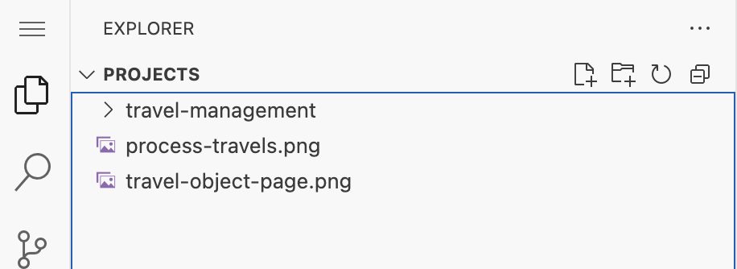
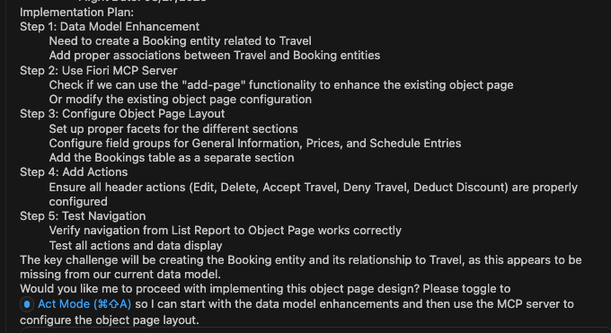
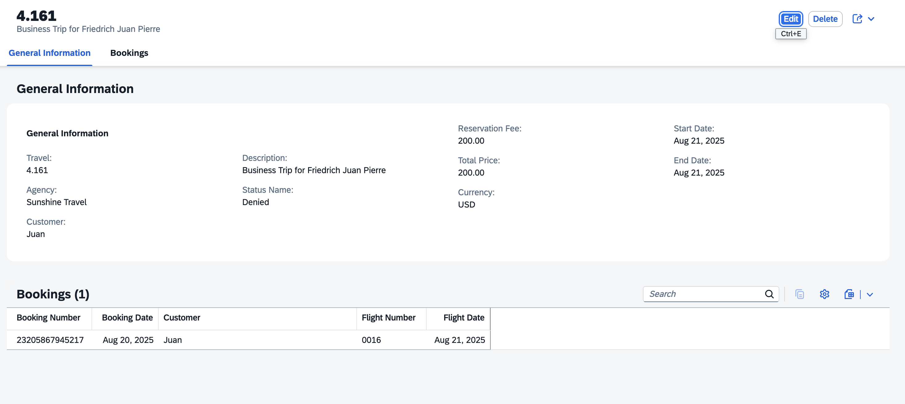

## Modify travel object page based on Image

1. Close the previous task and start a new one. Select **Plan Mode**.
2. Download image [travel-object-page](./images/travel-object-page.png).

    

3. Drag and drop image(travel-object-page.png) to Explorer.

    

4. Enter the following prompt in the task input:  
   ```
   Modify the travels object page based on Image @/travel-object-page.png
   The object page should include a bookings table section.
   Add mock data for the bookings table.
   ```
4. Press `Enter` to start the task.
5. Cline will generate an **Implementation Plan**.
6. Review the plan once it's ready. 
   - Review the header area/section should contain both title and description.
   - Make sure fields in sections are arranged to correct section and subsections.
   - Ensure the structure is one main General Information section with multiple subsections, not three separate sections.
     Enter prompt `prices and schedule entries are sub sections` to revise the plan.
   - If plan mentions header has general information and not in sections. Enter prompt `Header area does not contain general information` to revise plan.

> [!Note]
> The implementation plan generated by Cline may differ from the example shown below.



6. Switch to **Act mode**.

7. Cline will execute the implementation plan.

8. After completion, verify the object page in the application preview.



## Troubleshoot

If the object page looks different and does not match Uploaded object page image, execute prompt 
```
Match @/travel-object-page.png Image with object page
```

Continue to - [Exercise 2.1 - Add Custom Section with RichTextEditor Building Block](../ex2.1/README.md)
