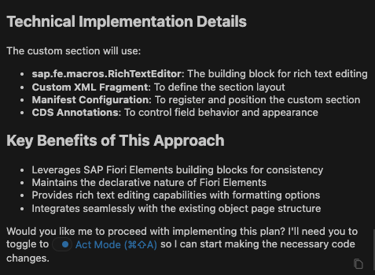
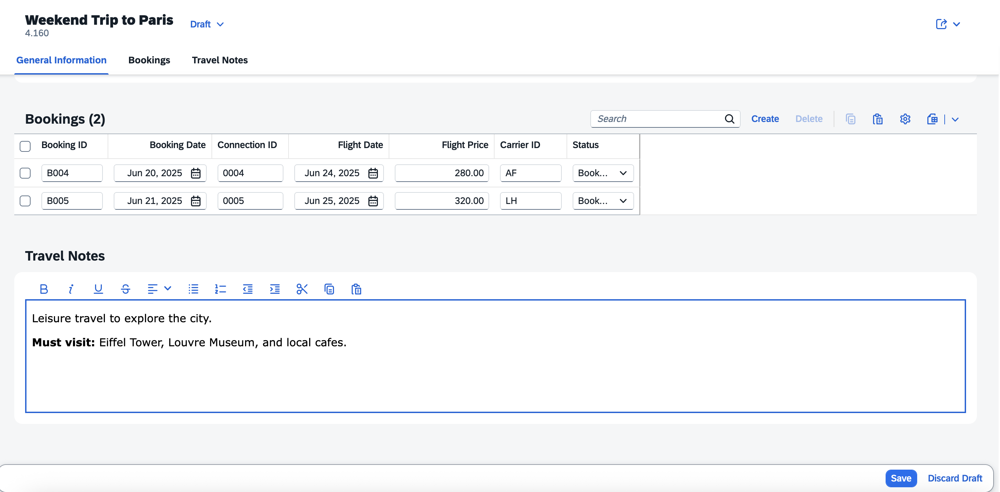
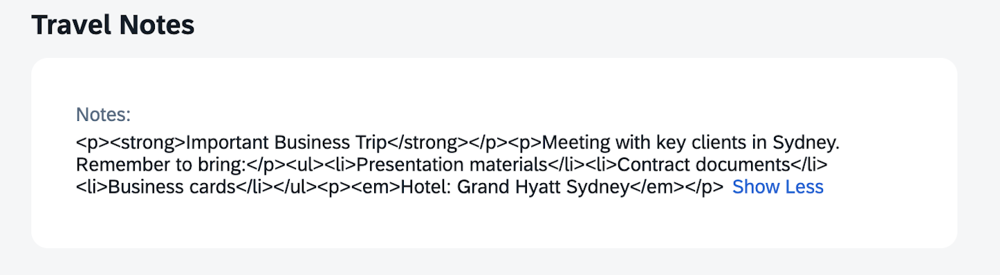

## Add Custom Section with RichTextEditor Building Block

1. In the Cline panel, select **Plan Mode**.
2. Enter the following prompt in the task input:  
   ```
   Create a new field, "TravelNotes," and extend the Fiori app by adding a custom section to the travel object page.
   This custom section should include a "RichTextEditor" with metadata building block to edit travel notes.
   Use fiori mcp.
   ```
3. Press `Enter` to start the task.
4. Cline will generate an **Implementation Plan**.
5. Review the plan once it's ready.

> [!NOTE]
> The implementation plan generated by Cline may differ from the example shown below.



6. Switch to **Act mode**.

7. Cline will execute the implementation plan.

8. After completion, confirm that the travel notes section is visible on the travel object page.
9. Click the Edit button in the top right corner.
10. In the travel notes section, select some text and apply bold formatting.
11. Click Save and verify the object is saved successfully.



## Troubleshoot

1. Custom section not visible. Execute prompt 
      ```
      Travel notes with RichTextEditor not visible
      ```

2. No data in custom section. Execute prompt 
      ```
      Add mock data for travel notes
      ```

3. Travel notes is not a Rich Text Editor. Execute below prompt and verify `RichTextEditorWithMetadata` code in the xml fragment
      ```
      use "RichTextEditorWithMetadata"
      ```

      

      for example
      ```
            <macros:RichTextEditorWithMetadata
                  id="travelNotesEditor"
                  metaPath="TravelNotes" />
      ```

4. Cannot edit travel notes RichTextEditor building block. 
      Execute prompt 
      ```
      Travel notes with RichTextEditor is not editable
      ```
