## Troubleshooting Guide


Sl no | Troubleshooting Guide
---------|----------
 1 | [How to restore files and tasks to a previous step](#1-how-to-restore-files-and-tasks-to-a-previous-step)
 2 | [MCP server connection failure](#2-mcp-server-connection-failure)
 3 | [CDS Compile error](#3-cds-compilation-error) 
 4 | [How to reset and start from scratch](#4-how-to-reset-and-start-from-scratch)
 5 | [Model Claude-4 is Not Responding - Invalid API response](#5-model-anthropic-claude-4-sonnet-is-not-responding)
 6 | [VS Code Terminal Timeout Issues](#6-vscode-terminal-timeout-issues)
 7 | [Cline Panel is Not Visible](#7-cline-panel-is-not-visible)
 8 | [Hard Reload Browser](#8-hard-reload-browser)


---

### 1. How to restore files and tasks to a previous step.

   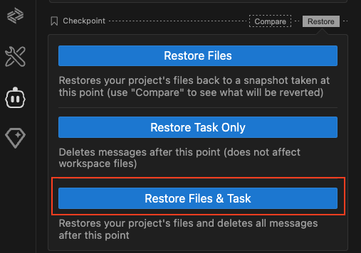

---

### 2. MCP server connection failure:
   In the Cline panel, if you notice that no response is received after Cline uses a tool from the MCP server, expand the API Request section to check for any errors related to the MCP tool.

   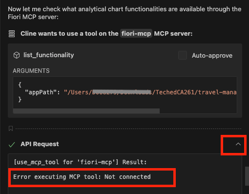

   - Click on `Manage MCP Servers`
   - Click on `Retry Connection`.
   - Verify mcp servers are connected again.

   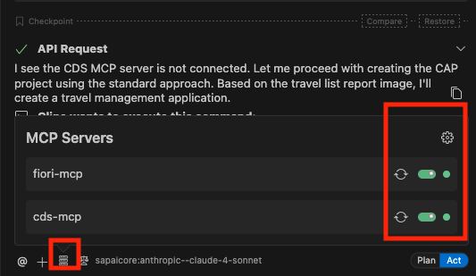

---

### 3. CDS Compilation error.
   - If you notice cds compilation error on console. copy and paste error message in to the task input.

   ```
   [ERROR] srv/travel-service.cds:5:10: Composition in draft-enabled entity can't lead to another entity with “@odata.draft.enabled” (in entity:“TravelService.Travel”/element:“to_Booking”)
   ```

   - Press `Enter`
   - Cline removes `@odata.draft.enabled` annotation applied on booking entity from cds service.

---

### 4. How to reset and start from scratch.
   - Close the current task.

   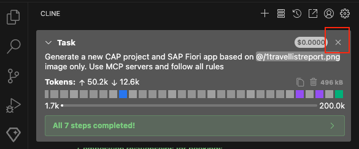

   - In the Explorer, right-click the project folder and select delete.

   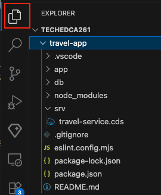

   - Open the Cline panel. Click on `view all history`

   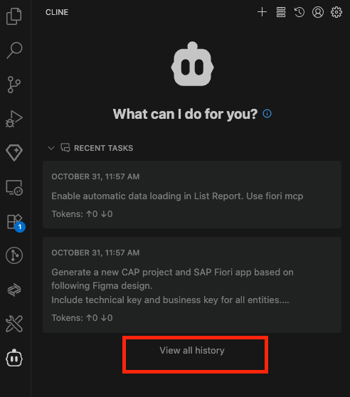

   - Click on `Delete All History` 

   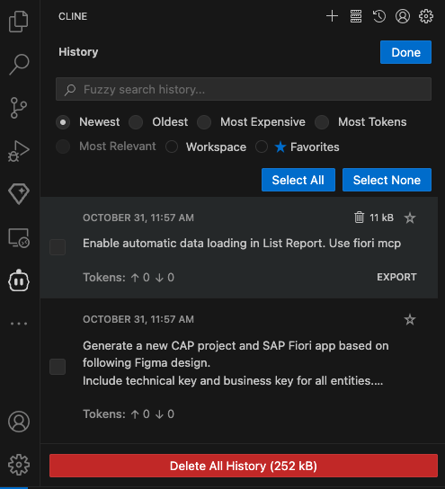

   - In the dialog, click `Delete Everything`.

   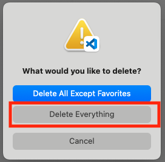

   - Then, in the Cline settings panel (top right corner), click `Done`.

---

### 5. Model `anthropic-claude-4-sonnet` is Not Responding

   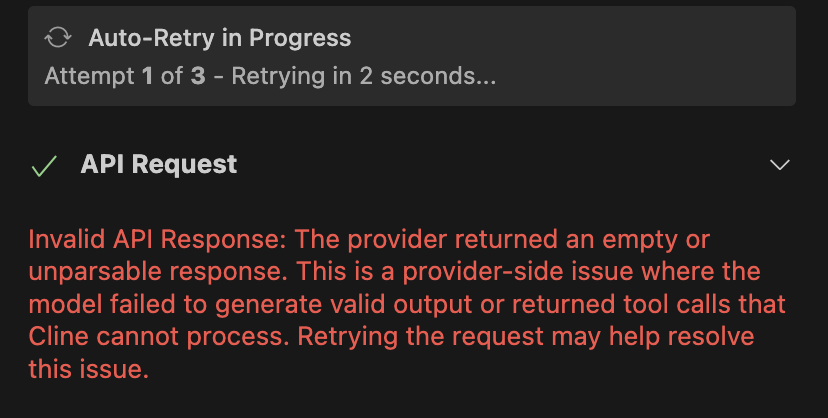

   - If the Claude 4 model throws Invalid API response error. Change model to the `anthropic-claude-3.7-sonnet`.
   - Retry your task.
   - If the issue still exists, try with model `anthropic-claude-3.5-sonnet`

   - If the issue still exists, then you can close the current Cline task and change model to `gemini-2.5-pro`.

   

---

### 6. Vscode Terminal Timeout Issues

- If the status in Cline remains pending and commands (such as `npm install`) are not executed in the VS Code terminal, toggle between **Act** and **Plan** mode, then click `Resume Task`.

  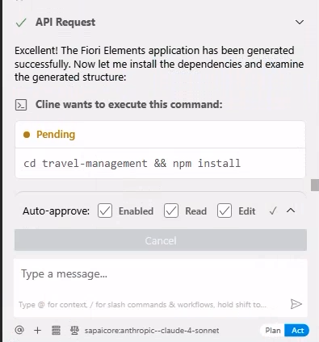

   Solution:

  

   - If the issue still exists, then you can close the current Cline task.
   - Reopen the same task again.
   - Resume from where it left off.

   

---

### 7. Cline Panel is Not Visible

- If the Cline panel is not visible in VS Code:
  - Press `Ctrl+Shift+P` (Windows/Linux) or `Cmd+Shift+P` (Mac) to open the Command Palette.
  - Type `View: Show Cline` and press Enter.
  - The Cline panel will appear in the sidebar.

  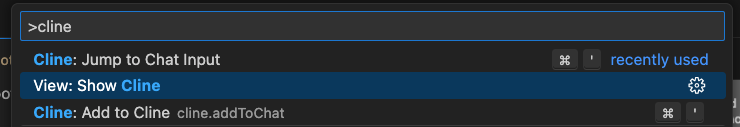

---
### 8. Hard Reload Browser

- If the application is not loading correctly or changes are not reflected in the browser preview:
  
  - Open Developer Tools by pressing `F12`
  - Long press the browser refresh button for 2-3 seconds until a dropdown menu appears
  - Select "Empty Cache and Hard Reload" from the dropdown menu

  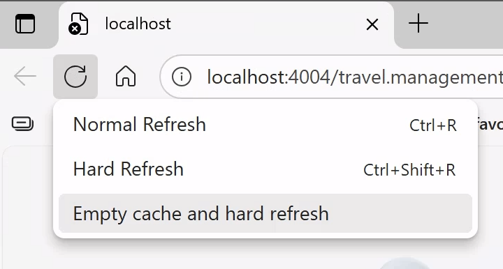

  This clears the browser cache and forces a complete reload of the page, ensuring all changes are properly displayed.

---

   
